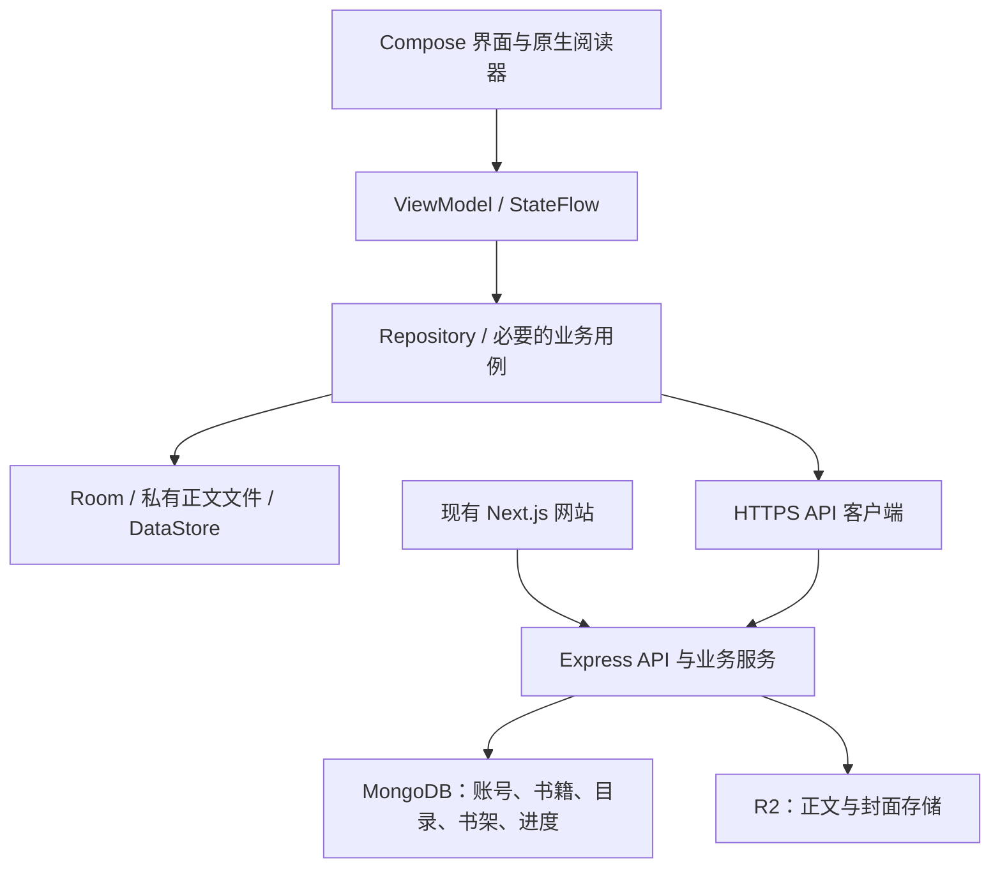

# 九天中文网安卓原生 App 技术方案

调研日期：2026-10-03。本文是建议方案，尚未创建安卓工程或改动网站运行代码。

## 推荐结论

采用 **Kotlin + Jetpack Compose + ViewModel/StateFlow + Repository + Room**，阅读器作为独立模块，使用 Android 原生文字排版与绘制能力。复用九天中文网现有 Node.js/Express、MongoDB 和 R2 后端，通过 HTTPS API 接入。

这属于原生 Android 开发路线，能够实现流畅翻页、离线阅读、系统返回手势等体验。没有充分的一手资料可以确认起点、番茄当前所有模块的内部技术栈，因此不把本方案描述成与它们的内部实现完全相同。选型依据是 Android 官方建议及本站业务特点。

Google 推荐新 Android 应用使用 Compose，并采用 UI/数据分层、ViewModel、单向数据流和协程；复杂、复用的业务逻辑再抽取用例层。本项目采用这个方向，不为每个简单接口增加多层包装。[Android 架构建议](https://developer.android.com/topic/architecture/recommendations)

## 技术与模块

| 范围 | 建议 | 本项目用途 |
| --- | --- | --- |
| 语言与构建 | Kotlin、Gradle Kotlin DSL、版本目录、稳定版工具链 | 原生 Android 工程，锁定并验证依赖组合 |
| 普通界面 | Jetpack Compose、Material 3 基础组件与自定义主题 | 书架、书城、搜索、详情、目录、账号、社区；保留九天自己的视觉风格 |
| 导航 | 单 Activity、Navigation 3 稳定版 | 返回栈、状态恢复、书籍/章节 App Links |
| 状态与异步 | ViewModel、不可变 UiState、StateFlow、Coroutines | UI 发出操作，ViewModel 更新状态，Repository 统一数据访问 |
| 依赖注入 | Hilt | 网络、存储、阅读器和后台任务依赖管理 |
| 网络 | Retrofit + OkHttp + kotlinx.serialization | 接入 JSON API，统一错误、超时、取消和认证刷新 |
| 本地数据 | Room + 应用私有正文文件 + DataStore | Room 存书架/目录/进度/下载元数据；私有文件存正文；DataStore 存字号主题等偏好 |
| 图片 | Coil | 封面与头像加载、缓存、目标尺寸缩放 |
| 后台任务 | WorkManager | 有约束、可重试的同步与下载队列；不能视为永久运行或准时推送服务 |
| 阅读器 | 独立 reader 模块；StaticLayout、Canvas/自定义 View，Compose 承载控件 | 中文排版、定位、滚动、分页、翻页手势 |
| 验证 | 单元测试、Compose UI 测试、Macrobenchmark、Baseline Profiles | 阅读正确性、生命周期恢复、启动/翻页/目录性能 |

Navigation 3 在本次查询时已有稳定版 1.2.0（2026-09-23），不使用文档示例中可能展示的 alpha 依赖；开工时重新核对工具链兼容性。[官方发布记录](https://developer.android.com/jetpack/androidx/releases/navigation3)

官方 [Now in Android](https://github.com/android/nowinandroid) 可作为 Kotlin/Compose 工程组织和测试参考。按本项目规模取舍，不照搬其全部模块。

建议工程放在现有仓库的 `android/`，独立构建和发布；初期分为 `app`、`core:data`、`core:ui`、`feature:reader`，其他功能先按包划分，边界稳定后再拆模块。遵循项目现有 main 工作流。

## 数据流与现有后端

已核对的仓库能力：

- `web-next/package.json`：Next.js/React 网页端。安卓界面重新实现；沿用业务规则、内容和品牌设计。
- `server/package.json`、`server/routes/reading.js`：Express/Mongoose 后端和书籍阅读接口。
- `server/routes/catalog.js`：按位置加载目录、锚点定位、目录版本校验与版本变化 409 响应，可以复用。
- `server/security.js`、`server/routes/auth.js`：HttpOnly Cookie 会话、Origin 检查和 CSRF 保护；没有可直接假定已存在的原生 Bearer 登录接口。
- `server/models/ReadingHistory.js`、`server/routes/library.js`：云端记录含 chapterId 和访问/阅读时间，尚无章内段落或字符偏移。
- `server/models/ParagraphComment.js`：已有 paragraphKey，安卓段落定位必须与网页端统一规范。
- `server/models/Chapter.js`、[R2 正文存储](R2正文存储.md)：正文支持 contentKey/contentSha256 与旧内联内容共存，继续由后端统一读取。

App 不直接连接 MongoDB，不携带 R2 凭据。首先复用现有 API 和业务服务；需要演进的移动端合同可新增 `/api/v1` 路由或适配层，保持现有 `/api` 客户端兼容。没有因为增加 Android 客户端就重写后端、迁移数据库或拆微服务的必要。

## 阅读器设计

这是最值得优先验证的模块。普通界面采用 Compose，阅读器排版与绘制独立实现，并通过 AndroidView 与 Compose 互操作。[Views 与 Compose 互操作](https://developer.android.com/develop/ui/compose/migrate/interoperability-apis/views-in-compose)、[StaticLayout.Builder](https://developer.android.com/reference/android/text/StaticLayout.Builder)

1. 先验证上下滚动和左右平移分页两种模式，再按实际需要补仿真翻页。翻页动画与排版算法分开。
2. 阅读位置采用 `bookId + chapterId + contentVersion + paragraphKey + charOffset`，明确文本规范化和偏移单位，不能把屏幕页码当作跨端阅读位置。重排后用锚点恢复。
3. 正文更新时按版本使旧分页缓存失效；段落变化时按规范匹配，无法匹配则回退到可解释的位置，避免无提示地跳到另一段。
4. 分页缓存包含正文版本、字体、字号、字重、行距、页边距和可用宽高；排版在后台线程进行并支持取消，绘制回到主线程。
5. 长章分块处理、有界预排相邻页面/章节；不一次计算整本书，也不在每次手势中重新排版全文。
6. 原生文字布局负责字体 shaping 和换行；需要覆盖中文标点、首行缩进、英文/数字混排、emoji、超长段落、自定义字体及字体缩放。自绘文字也必须提供无障碍语义和选择/复制能力。
7. 目录继续按版本和窗口加载，支持万章级目录及跳转；阅读器不等待整本目录下载才显示正文。

这是一项针对本站的工程建议，不代表自绘一定比 Compose 文字组件快。先做可运行的阅读器原型，以实机排版正确性、内存和帧耗时确定实现细节。

## 离线与跨端同步

阅读、书架和进度采用离线优先：UI 从本地状态获得数据，网络更新写回本地，再驱动界面。下载和同步按电量、网络、用户设置运行。[Android 离线优先指南](https://developer.android.com/topic/architecture/data-layer/offline-first)、[后台任务调度](https://developer.android.com/develop/background-work/background-tasks/persistent)

- 正文用不可变内容版本/哈希校验并原子落盘；Room 保存下载状态。区分可淘汰的自动缓存与用户主动下载，后者不放到系统可随时清理的 cache 目录。
- 进度先本地提交再入同步队列。请求有操作 ID、设备标识和版本，重试幂等；书架移除保留必要的删除标记，防止旧设备把书重新加入。
- “最近阅读位置”和“读到的最远位置”分开；重读前章是合法操作，不能一律用最大章号覆盖进度。
- 冲突用服务端修订号及明确规则处理，旧离线设备不能只靠上传时刻覆盖新进度。必要时让用户选择从哪一处继续。
- 网页端与 Android 共同升级到章内锚点合同后，才能准确跨端续读；只改 App 不足以完成整套体验。

## App 接口需要补齐的部分

1. **移动端会话**：复用账号、密码校验及封禁/撤销规则，增加适合原生客户端的短期访问令牌、可轮换刷新令牌与设备会话管理。刷新令牌在服务端保留摘要，客户端用 Android Keystore 支持的加密存储方案保存；退出、改密、封禁均能撤销。浏览器保留现有 Cookie/CSRF 防护，不通过关闭全站防护来兼容 App。
2. **稳定的数据合同**：整理书籍、目录、正文、书架与进度的 OpenAPI 说明，统一错误码、正文版本、分页和字段含义。Android 发布后用户会保留旧版本，接口需要向后兼容。
3. **章内进度与段落规范**：扩展现有历史记录，规定 paragraphKey 与字符偏移生成方法，并在网页端和 Kotlin 端使用同一组样例验证。
4. **增量同步与缓存**：复用目录版本和章节哈希，补充必要的条件请求、下载状态、幂等操作；按性能证据决定是否增加批量接口。

这些是待实现项目，不把现有网站描述为已经具备全部 App 接口。

## 实施顺序与验收

| 阶段 | 交付 | 验收重点 |
| --- | --- | --- |
| 1. 阅读链路原型 | 原生工程、真实书籍/目录/正文接入、两种基础阅读模式 | 长章完整、分页不漏字重字、调整字体定位稳定、返回/进程恢复 |
| 2. 可日常使用的首版 | 登录、书城/搜索/详情、书架、阅读设置、离线下载、云端进度 | 断网可读、下载可恢复、身份切换隔离、网页与 App 续读一致 |
| 3. 功能与发布完善 | 书评/段评/社区、按需听书/通知、签名安装包与更新机制 | 无障碍、后台行为、低配置设备、崩溃恢复、升级兼容 |

听书若纳入范围，再引入系统 TTS 与合适的 Media3/媒体会话集成。国内分发的通知能力应依据设备和渠道选择，不把依赖 Google 服务的推送作为基础阅读功能的前提。

开工时固定支持的 Android 版本和测试设备；可先以 Android 8.0/API 26 为候选最低版本，再结合真实用户设备与所选依赖确认。targetSdk 按实际发布时的渠道要求确定，不在调研阶段绑定过时政策。

功能测试覆盖中断下载、服务端正文更新、重复同步、快速换章、旋转/进程死亡、超大字号与长目录。性能用中低端 Android 真机和 release/benchmark 构建测量，关注启动、书架滚动、翻页、排版耗时与内存。Baseline Profiles 的收益通过 Macrobenchmark 验证，不只看高配置模拟器的观感。[官方性能验证说明](https://developer.android.com/topic/performance/baselineprofiles/measure-baselineprofile)

## Astra 使用方式

主智能体可保留 Astra Ultra 负责需求、架构和集成判断；子智能体按项目 AGENTS.md 为清晰任务选 low/medium，为困难逻辑或审查选 high/xhigh，只有明确必要才使用 max/ultra，默认并发不超过 2 个。构建、完整比对和测试由脚本运行，模型只接收摘要与异常。

官方说明：没有子智能体覆盖配置时会继承父级；显式 spawn 参数、agents 默认值和自定义角色配置会影响实际选择。高 effort 与多智能体都可能增加 token 用量，因此不能仅凭 Ultra 档位推断历史消耗，也不能承诺降档节省固定百分比。[OpenAI 子智能体说明](https://learn.chatgpt.com/docs/agent-configuration/subagents)

额度还受模型、上下文、工具结果与缓存影响。Ultra 推理档位和 Ultrafast 速度档位是不同的设置，速度档位另有计费差异。[OpenAI 用量与价格说明](https://learn.chatgpt.com/docs/pricing)
